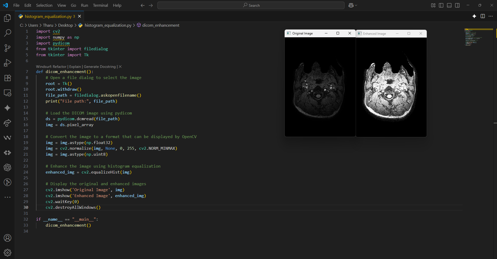

# DICOM Image Enhancement

This repository provides tools for enhancing DICOM (Digital Imaging and Communications in Medicine) images using histogram equalization. It is primarily implemented in Python and utilizes popular libraries such as `pydicom`, `opencv-python`, and `numpy`.

## Features

- **DICOM Image Loader**: Select and load DICOM images using a file dialog.
- **Histogram Equalization**: Apply histogram equalization to improve the contrast of medical images.
- **Side-by-side Visualization**: View both the original and enhanced images for comparison.

## Requirements

Before running the scripts, install the required packages:

```shell
pip install pydicom
pip install opencv-python
pip install numpy
```

## Usage

1. Run the `histogram_equalization.py` script:
    ```shell
    python histogram_equalization.py
    ```
2. A file dialog will appear. Select your DICOM image file.
3. The script will display the original and enhanced images using OpenCV.

## Example

Below is a screenshot showing the code and sample output window with both the original and enhanced images:



## How it Works

- The script loads a DICOM image using `pydicom`.
- The pixel data is normalized and converted for display.
- Histogram equalization is applied to enhance image contrast.
- Both the original and enhanced images are shown for visual comparison.

## License

This project is licensed under the MIT [License](LICENSE).